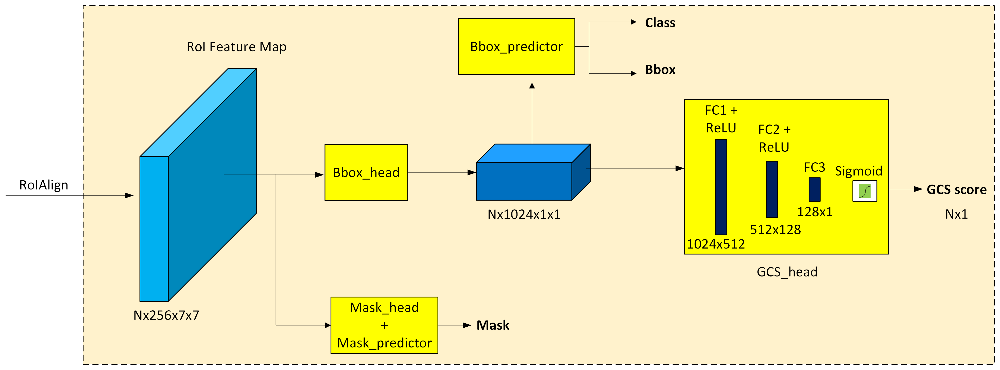

# 🏗️ Source code for training and testing our CNN 

** Segmentation and GCS head implementation in Mask-RCNN head  **

<p align="center">
  
</p>


## 🚀 Training with Multiple GPUs:
```bash
python -m torch.distributed.launch --nproc_per_node=2 --use_env train.py --batch-size 5 --world-size 2 --lr 0.005 --has_gcs_branch
```

## 🚀 **Training with a single GPU:**
```bash
python train.py --batch-size 5 --lr 0.0005 --has_gcs_branch
```

## 🚀 **Training Without Aspect Ratio Grouping:**
```bash
--aspect-ratio-group-factor -1
```

## 🚀 **Group Inference**
```bash
python inference_group.py --resume /checkpoint_path/checkpoint.pth --has_gcs_branch


## Downloads the trained weights
```bash
https://drive.google.com/file/d/1WUos4exRMeDjz9_zXgVHsCkNCYoJbD8s/view?usp=sharing
