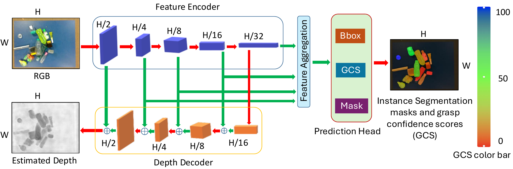
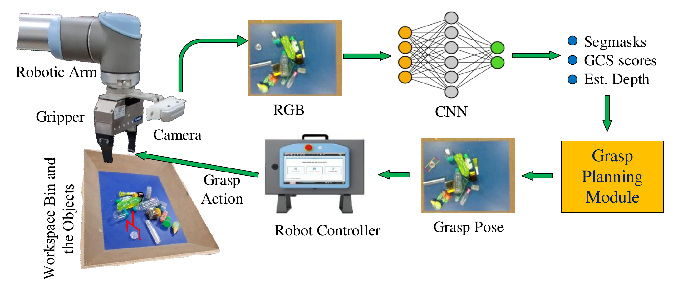

# Source code for our work "Bin-picking with category-agnostic segmentation for unreliable depth scenarios"

# How to access the code?

Please navigate to repective folders:
CNN_src - source code for our cnn design, training and testing
simulation - source code for simulation for generating training data
grasp_planning - source code grasp-pose planning and execution 
