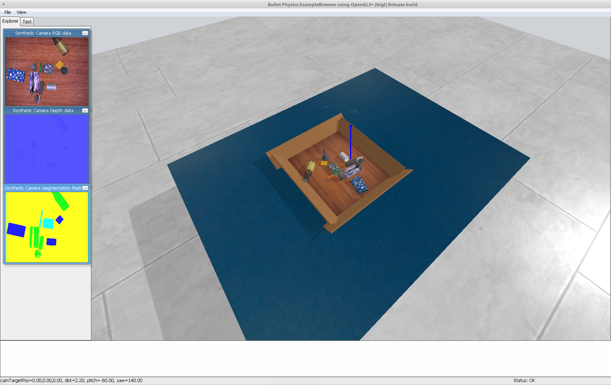

# Simulation source code for data generation

### **A screenshot of the simulated environment in PyBullet used for data generation**



## 🚀 Install dependencies:
```bash
pip install -r requirement.txt
```

## 🚀 Generate data:
```bash
python main_cas_data.py
```


## 🚀 Note:
Please change image_size, num_scene and other parameters in main_cas_data.py file as per the requirement.
