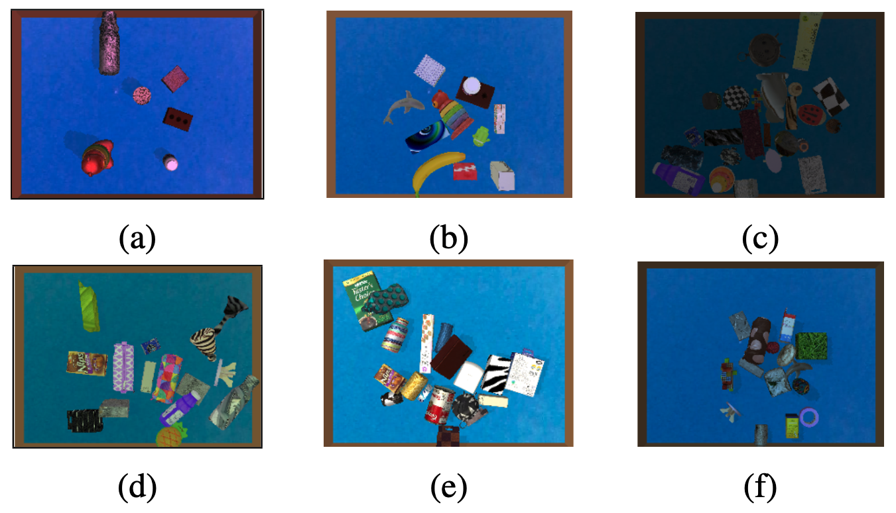

# Simulation source code for data generation

### **A screenshot of the simulated environment in PyBullet used for data generation**


### **A few of the samples generated with this environment**


## 🚀 Install dependencies:
```bash
pip install -r requirement.txt
```

## 🚀 Generate data:
```bash
python main_cas_data.py
```


## Note:
Please change image_size, num_scene and other parameters in main_cas_data.py file as per the requirement.

## Batch processing for fast data generation
Please modify the batch_run_cas.sh file to specify the number of parallel processes based on your system capacity.
```bash
bash batch_run_cas.sh
```
